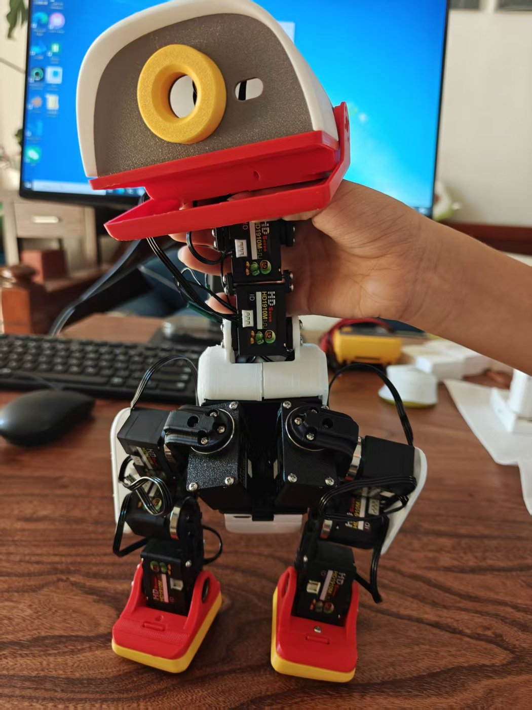

# 构建日志

**简体中文** · [English](BUILD-LOG.en.md)

> **当前状态：飞特 HD-1910 版整机装配完成**
> 最后更新：2026-09-13　|　已有实物照片 ↓

本仓库的其余部分都是**纸上分析** —— 从公开的 MJCF 与源码反推出的几何、装配关系和电控方案。
这份日志记录的是**把它真正做出来**的过程：打了什么、装了什么、哪里出了问题。

> ⚠️ 本仓库反复强调过一个判断：**仿真 STL 不是可打印工程件** ——
> 仿真只保证外形与惯量，不保证配合公差、螺纹、埋件座和走线空间。
> **这份日志就是在验证这句话到底对不对。** 结论会如实写在这里，无论正反。

---

## 进度

| 日期 | 阶段 | 状态 | 备注 |
|---|---|---|---|
| 2026-09-01 | 首批零件打印 | 🔨 进行中 | 头壳、躯干壳、腿部结构件、脚 |
| 2026-09-02 | 腿部件试装 | ✅ 完成 | **M2 螺丝已装入，孔位可用** |
| 2026-09-12 | 飞特版结构件改模重打 | ✅ 完成 | **HD-1910 舵盘凸、XL330 舵盘凹**，8 个配合件改了 |
| 2026-09-13 | 整机装配 | ✅ 完成 | 15 颗 HD-1910 配好 ID 装进去，见下 |

图例：📋 计划中 · 🔨 进行中 · ✅ 完成 · ⚠️ 遇到问题 · ❌ 此路不通

---

## 打印记录

| 零件 | 材料 | 层高 | 填充 | 耗时 | 结果 |
|---|---|---|---|---|---|
| *(待填)* | | | | | |

**打印机 / 切片软件**：*(待填)*

---

## 踩过的坑

> 这一节是整份日志最有价值的部分 —— **别人可以不重复踩。**
> 每条按「现象 → 原因 → 解决」写，没解决的就写「未解决」。

### （待填）

**现象**：
**原因**：
**解决**：

---

## 尺寸与配合验证

反推出来的数据在实物上对不对：

| 项目 | 反推值 | 实测值 | 是否吻合 |
|---|---|---|---|
| 整机外形 | 144 × 141 × 264 mm | *(待测)* | |
| M2 过孔 | Ø2.2 mm | *(待测)* | |
| M2 沉头孔 | Ø4.4 mm | *(待测)* | |
| M2 攻丝底孔 | Ø1.6 mm | *(待测)* | |
| 轴承座 | Ø22 × 16 × 4 mm | *(待测)* | |

> FDM 打印通常会让孔径偏小 0.1–0.3 mm，这一栏的实测数据对后来者价值很大。

---

## 待解决

- [ ] *(待填)*

---

## 照片

### 2026-09-02 · 首批打印件


已打印并部分装配的零件：

- **头部总成** —— 多色打印（白 / 黑 / 红），含摄像头环座与指示灯开口，表面质量良好
- **颈部** —— 黑色，已与头部连接
- **躯干外壳** —— 白色
- **腿部结构件** —— 黑色，**M2 螺丝已装入**
- **脚** —— 红 / 黄双色，两只

> 📌 **第一个实物验证点**：黑色腿部件上的 **M2 螺丝已经装进去了**。
> 这说明 [紧固件反推](docs/紧固件反推.md) 得出的「整机是 M2 螺丝系统」这个结论，
> 在实物上是成立的 —— 至少这几个孔位是。
>
> 精确孔径实测数据待补，见上方「尺寸与配合验证」表。

---

## 2026-09-13 · 飞特 HD-1910 版装出来了

<table><tr>
<td width="50%"></td>
<td width="50%"></td>
</tr></table>

**15 颗 HD-1910 全部配好 ID、装进机身。** 头、颈、两腿、脚，一颗不少。

**发现的问题**：HD-1910 跟 XL330 外形接近（34×20×23 vs 20×34×26），但**舵盘不一样 —— HD-1910 是凸出来的，XL330 是凹进去的**。
原版结构件是按凹舵盘设计的，直接装装不进去。同事把跟舵盘配合的件全改了：

```
left_upper_leg / right_upper_leg   上腿          髋 pitch 和膝的舵盘位
leg                                小腿          膝和踝的舵盘位
trunk_base                         躯干底座       髋 yaw 舵机位
yaw2roll                           偏航转横滚     髋 yaw 舵盘 → 髋 roll
bearing_roll                       轴承滚轮       髋 roll 轴承座
01-upper_leg_rigidity_plate        上腿加固板
99-yaw_roll_motion                 头部 yaw/roll  两个变体
```

改后的 SolidWorks 图纸（`-FT` 后缀）和 9 个 STEP 在
[microduck-replica-cad · v2.0](https://github.com/fanhao375/microduck-replica-cad)。

**下一步**：台架通总线（URT-2 → Radxa），见 [调试记录](调试记录.md)。
